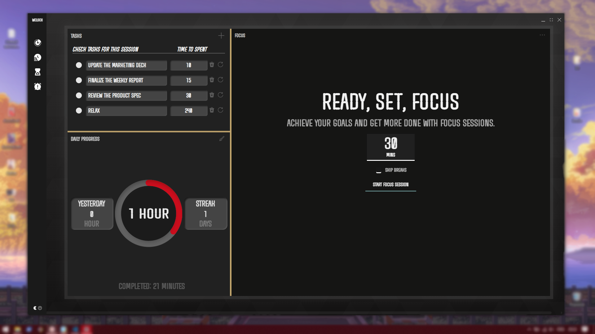

# WClock
A cross-platform offline desktop application inspired by the Windows Clock app, designed to work seamlessly without relying on the Microsoft Store. Built with [Go](https://go.dev/), [Wails](https://wails.io/), and [Svelte 5](https://svelte.dev).

## Tested Platforms
- **Windows 10** (x64)
- **Ubuntu Linux** (24.04)

---

## Features
WClock offers a suite of intuitive and practical tools for time management and productivity:

- **Focus Mode**: Stay concentrated with customizable focus timers.
- **Stopwatch**: Track elapsed time with precision.
- **Task View**: Organize and manage your tasks efficiently.
- **Break Timer**: Schedule breaks to maintain productivity and well-being.

<div style="display: flex; flex-wrap: wrap; gap: 20px; justify-content: center;">
  
  
  
  
</div>

---

## Installation

### Windows
Download the latest version of **WClock** from the [Releases](https://github.com/DDExpo/wclock/releases) page and follow the installer instructions.

### Linux
1. Navigate to the [latest release](https://github.com/DDExpo/wclock/releases/latest).
2. Download the Linux archive (`WClock-vX.Y.Z-linux-amd64.tar.gz`).
3. Extract the archive:
   ```bash
   tar -xvzf WClock-vX.Y.Z-linux-amd64.tar.gz
   ```
4. Run the binary:
   ```bash
   ./WClock
   ```

### Build from Source
To build WClock yourself, ensure you have the following prerequisites:
- **Go** (≥ 1.21)
- **Wails** (v2.10)
- **Svelte 5**

Steps:
1. Clone the repository:
   ```bash
   git clone https://github.com/DDExpo/wclock.git
   ```
2. Install [Go](https://go.dev/) and [Wails](https://wails.io/), then follow the [Wails Svelte guide](https://wails.io/docs/guides/sveltekit/).
3. ```npm install svelte-dnd-action```
4. Navigate to the project directory:
   ```bash
   cd ./WClock/wclock
   ```
5. Run the development server:
   ```bash
   wails dev
   ```

---

## Reporting Issues
If you encounter bugs, have feature requests, or need assistance:

1. Visit the [Issues page](https://github.com/DDExpo/wclock/issues).
2. Click **New Issue** and select the appropriate template (Bug Report, Feature Request, or Question).
3. Provide detailed information, including:
   - **Operating System and Version** (e.g., Windows 10, Ubuntu 24.04)
   - **WClock Version** (check the [Releases](https://github.com/DDExpo/wclock/releases) page)
   - Steps to reproduce the issue
   - Screenshots or logs, if available

Your feedback helps improve WClock.

---

## Credits & Acknowledgements
WClock was built using the following open-source tools and resources:
- [Dark Background](https://www.svgbackgrounds.com/)
- [Light Background](https://bgjar.com)
- [Icons](https://www.flaticon.com/uicons)
- [Fonts](https://www.fontspace.com/beautiful-police-officer-font-f113574)
- [Drag-and-Drop Implementation](https://github.com/isaacHagoel/svelte-dnd-action)

Big thanks to the creators and communities behind these projects.

---

## License
This project is licensed under the [MIT License](LICENSE).